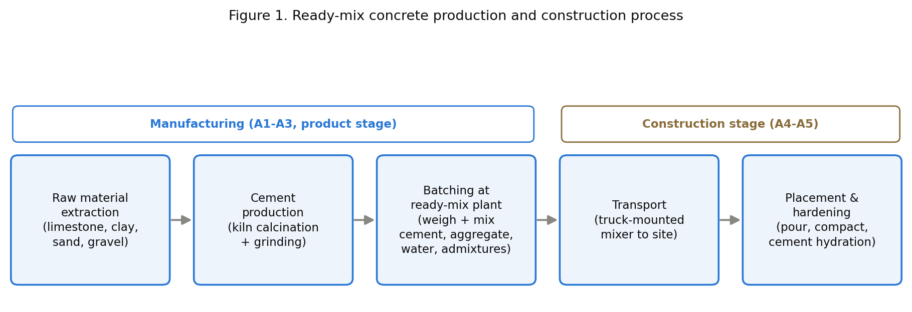
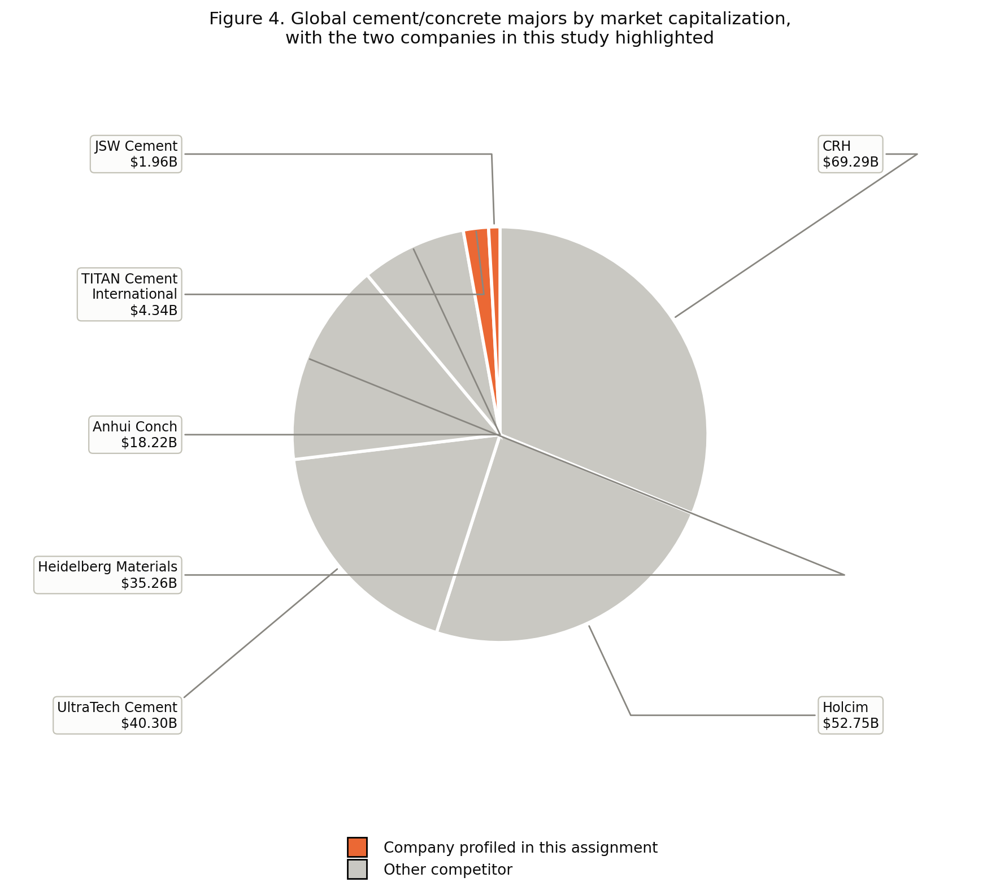
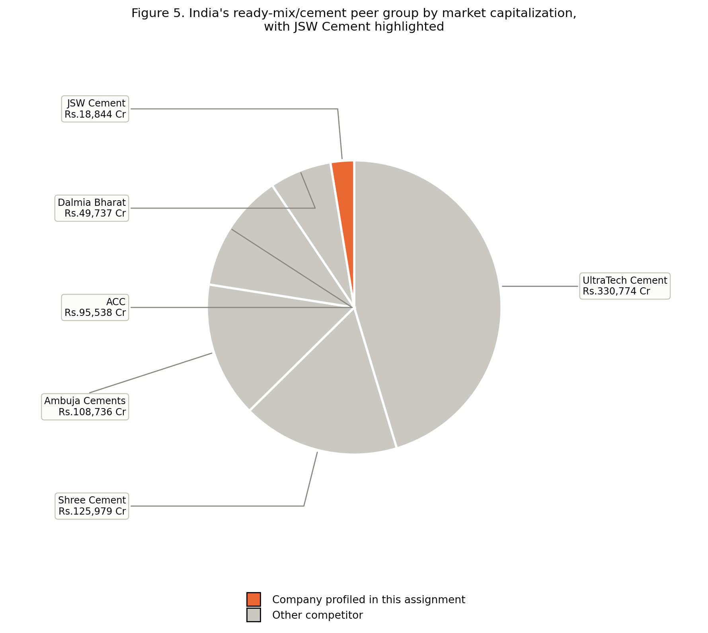
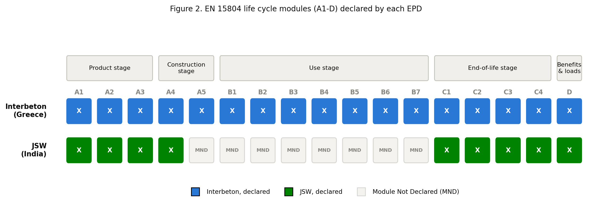
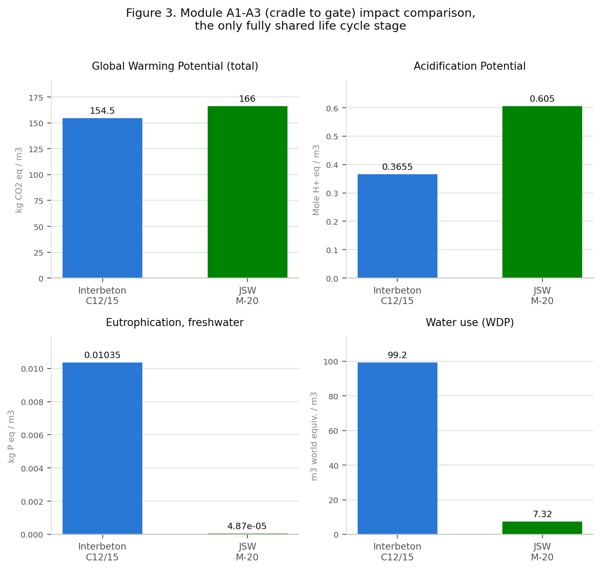

# Final Assignment: Industrial Ecology and Life Cycle Assessment (LCA)

## Comparative EPD Analysis of Ready-Mix Concrete: Interbeton (Greece) vs. JSW Green Cement (India)

Omri Shamgar
Tomer Tasa

Industrial Ecology and Life Cycle Assessment (LCA), Course 5040
Reichman University
[Instructor name]
Submission date: 01/08/2026

---

## 1. Introduction: Understanding the Product System

### 1.1 Product description

Ready-mix concrete is a composite building material formed by mixing cement, coarse and fine aggregates, water, and (optionally) chemical admixtures, batched centrally and delivered to construction sites in a fluid state by truck-mounted mixer (Interbeton Building Materials S.A., 2021; JSW Green Cement Private Limited, 2022). Once placed and compacted, the mix hardens through the hydration of cement, a chemical reaction in which the finely ground cement powder forms a paste that binds the aggregates into a solid matrix and continues gaining strength for years afterward.

Figure 1 sets out the manufacturing process from raw material to finished pour.

Of these steps, cement production is the one that matters most for the rest of this assignment: the kiln that calcines limestone into clinker is the single most energy- and emissions-intensive stage in the entire chain, and it is the reason cement, not aggregate or water, dominates the impact results in Section 4.

### 1.2 Environmental impact of the sector

Cement, the binding ingredient in concrete, is responsible for roughly 7% of global CO2 emissions, mostly from limestone calcination and fuel combustion in the clinker kiln (Global Cement and Concrete Association [GCCA], 2021). Concrete itself is the second most consumed material on earth after water, which means that even a modest per-unit footprint scales into a large absolute one (Interbeton Building Materials S.A., 2021).

A 2024 review of current LCA practice for cement and concrete found that the clinker/kiln stage consistently dominates climate-change impact across studies, and identified inconsistent system-boundary selection as the leading cause of poor comparability between published concrete LCAs and EPDs (Olsson et al., 2024), a finding this assignment reproduces directly when comparing Interbeton and JSW in Section 4.

Beyond climate change, the sector's other material environmental concerns are:

- Acidification and eutrophication, driven mainly by cement kiln flue-gas emissions (SO2, NOx) and, downstream, by fertilizer- and mining-related background processes in the aggregate and admixture supply chains.
- Resource depletion, since aggregates are a finite, quarried resource and cement production consumes significant fossil energy.
- Water use, both in batching and in the broader mining/quarrying supply chain, which is especially material in water-stressed regions.

### 1.3 Market and industry trends

The global ready-mix concrete market is fragmented and regional: concrete cannot be shipped far, since it sets within hours, so production is organized around dense local plant networks rather than global trade. Both companies compared in this assignment illustrate that structure: Interbeton (TITAN Group) operates 29 ready-mix plants across Greece, and JSW Green Cement operates its ready-mix business through plants in Dolvi, Vijaynagar, and Deonar, India.

That local production footprint sits underneath a small number of very large, globally listed parent companies. Figure 4 places TITAN Cement International (Interbeton's parent) and JSW Cement (JSW Green Cement's parent) against the world's largest listed cement and concrete groups by market capitalization. Both companies profiled in this assignment are minor players by global market-value standards, several orders of magnitude smaller than CRH, Holcim, or UltraTech Cement, despite each being a leading domestic producer in its own country.

Source: CompaniesMarketCap.com (2026) and company-specific market data; TITAN Cement International converted from EUR at 1 EUR = 1.1413 USD; JSW Cement converted from INR at 1 USD = 96.36 INR (both rates as of 21/07/2026). Retrieved 21/07/2026.

Within India specifically, JSW Cement is a small challenger against a consolidated set of incumbents. Figure 5 compares JSW Cement to its five main domestic peers.

Source: Screener.in (2026) market data. Retrieved 21/07/2026.

Greece does not offer an equivalent domestic chart with comparable data. TITAN is the country's only large, independently listed cement and concrete producer; its main domestic competitor, Heracles General Cement Company, has been a wholly owned subsidiary of Holcim since 2018 and does not report a separate market capitalization. The meaningful comparison for the Greek market is therefore already captured in Figure 4: TITAN against Holcim at the parent-group level.

Two forces are currently reshaping the sector's approach to LCA and reporting:

- Industry-level decarbonization commitments. In October 2021, 40 of the world's largest cement and concrete producers, representing roughly 80% of global cement volume outside China, committed to a joint roadmap targeting net-zero CO2 emissions by 2050, including a 25% cut by 2030 through reduced clinker content, fuel switching, and carbon capture (GCCA, 2021). TITAN Group, Interbeton's parent, is a GCCA member and frames its EPD explicitly as a milestone on that roadmap.
- Growing EPD adoption as a market differentiator. Both companies in this study voluntarily produced third-party-verified EPDs under the same international programme, even though neither national market currently mandates it, signaling that construction product transparency is becoming a competitive expectation rather than a purely regulatory one.

---

## 2. PCR Methodology

### 2.1 Introducing the PCR

This assignment uses PCR 2019:14 "Construction products" (Version 1.11, published 05/02/2021) together with its concrete-specific complementary rules, c-PCR-003 "Concrete and concrete elements" (based on EN 16757:2022, UN CPC classification 375, current version 1.0.0 published 08/04/2025, valid until 07/04/2030). PCR 2019:14 is the general-purpose PCR for all construction products under the International EPD® System; c-PCR-003 narrows it to concrete specifically, in line with the European standard EN 16757.

A structural detail matters here: c-PCR-003 is a thin document. Of its eight substantive sections, five (functional/declared unit, system boundary, life cycle inventory, life cycle impact assessment, and EPD content/format) state only "as in PCR 2019:14 and EN 16757:2022" rather than setting independent rules. c-PCR-003's own original contribution is narrow: it defines the product scope (concrete and concrete elements, excluding autoclaved aerated concrete) and confirms conformance to EN 16757:2022. This matters directly for the comparability analysis in Section 4: a PCR that mostly defers to its parent document, on system boundary in particular, leaves EPD authors considerable latitude, and that latitude is where Interbeton and JSW diverge.

### 2.2 Evaluating the PCR against the brief's criteria

Because c-PCR-003 defers most methodological content to PCR 2019:14 (not separately obtained for this assignment, consistent with the assignment's own guidance to focus effort on the EPD comparison itself), the following evaluation combines what c-PCR-003 states directly with what both EPDs declare in practice, which is the best available evidence of how the PCR's requirements are implemented in the field.

| Evaluation criterion | Assessment |
|---|---|
| Functional or declared unit | Declared unit: 1 m3, identical in both EPDs. Neither EPD uses a functional unit. Confirmed by c-PCR-003's own diagram, which shows that a PCR 2019:14 EPD without a complementary c-PCR is declared-unit-only, and c-PCR-003 does not introduce a functional-unit requirement of its own. |
| System boundary definition | Not fixed by c-PCR-003 itself ("as in PCR 2019:14"). Life cycle stages are clearly defined and labeled in both EPDs using the same modular A-D table, but the choice of which modules to declare is left to the EPD author, which is the root cause of the Interbeton/JSW divergence covered in Section 4.3. |
| Processes declared in the system boundary | Both EPDs include clear process-flow diagrams for their declared modules. Where a module is declared, the underlying processes are reasonably complete; the gap is in which modules are declared at all, not in what happens inside a declared module. |
| Reference service life | Not mandated by c-PCR-003. Interbeton states 50 years explicitly; JSW states none, consistent with declaring no use-stage (B) modules. |
| Data quality requirements | Not spelled out in c-PCR-003. Both EPDs independently apply ISO 14044 data-quality assessment, and both differentiate primary (company ERP/production data) from secondary (Ecoinvent or GaBi) data, though Interbeton documents this per-flow in an itemized "Product Data Sources" table while JSW describes it more generally. |
| Recommended databases | Not specified by c-PCR-003. Each author chose its own: Interbeton uses the GCCA Industry EPD Tool (built on Ecoinvent v3.5); JSW uses GaBi 10.5 (Sphera). Different tools, same PCR. |
| Allocation rules | Not specified independently by c-PCR-003. Both EPDs state that no allocation was required, since neither production process yields co-products. |
| Cut-off criteria | Not specified independently by c-PCR-003. Both apply a similar 1% mass/energy cut-off consistent with general EN 15804 practice. |
| Impact categories | Not specified by c-PCR-003 directly, but both EPDs report the identical EN 15804:2012+A2:2019 core indicator set (GWP-total/fossil/biogenic/luluc, ODP, AP, EP-freshwater/marine/terrestrial, POCP, ADP-minerals and metals, ADP-fossil, WDP). This consistency traces to EN 15804 itself, the shared foundation beneath both the PCR and the c-PCR, not to c-PCR-003's own text. |
| EPD reporting format | c-PCR-003 defers to "PCR 2019:14 and EN 16757:2022" for content and format. Both EPDs follow a near-identical modular reporting layout, evidence that this shared template is working as intended. |
| Consistency with ISO standards and GPI | Both EPDs cite ISO 14025:2006 (JSW additionally cites ISO 14040/44 directly); c-PCR-003 itself sits explicitly under EN 15804/ISO 21930 in its own document hierarchy. No deviations from ISO alignment were found in either EPD. |

The overall picture: PCR 2019:14 plus c-PCR-003 achieves strong consistency on what gets measured (impact categories, units, reporting format) because that is anchored in EN 15804 itself, but weak consistency on how much of the life cycle gets measured (system boundary, reference service life), because the PCR structure leaves that choice open. Section 4 shows how much that gap matters in practice.

---

## 3. Presenting the Selected EPDs

### 3.1 The two EPDs

Interbeton Building Materials S.A., a TITAN Group company in Greece, published EPD registration number S-P-05027 for Ready Mixed Concrete C12/15 on 16/12/2021, valid until 15/12/2026. It was independently verified by Eurocert S.A., an accredited certification body (accreditation: E.SY.D., the Greek national accreditation body). The declared product covers a 15 MPa concrete mix design produced across 29 regional ready-mix plants in Greece.

JSW Green Cement Private Limited, a subsidiary of the JSW Group in India, published EPD registration number S-P-06471 for 1 m3 of Ready-Mix Concrete on 01/11/2022, valid until 31/10/2027. It was independently verified by Dr. Hüdai Kara of Metsims Sustainability Consulting, an individual verifier approved directly by the International EPD® System. Unlike Interbeton's single-strength-class EPD, JSW's declaration covers eleven grades (M-7.5 through M-60) produced across three plants (Dolvi, Vijaynagar, Deonar), with a separate results table for each grade.

Both EPDs are registered under the same programme, the International EPD® System, and confirm compliance with the same core PCR version (PCR 2019:14, v1.11, 05/02/2021) and the same concrete-specific complementary rules (c-PCR-003 / EN 16757), satisfying the brief's requirement that both EPDs follow the same PCR.

### 3.2 General characteristics compared

Both EPDs declare the same unit: one cubic meter (1 m3) of ready-mix concrete. Neither uses a functional unit, which would require specifying a performance parameter such as strength over a defined service life; both instead use the simpler declared unit, consistent with what c-PCR-003 permits (Section 2.2).

| Characteristic | Interbeton (Greece) | JSW (India) |
|---|---|---|
| Product description | Ready-mix concrete, C12/15, 15 MPa, density 2,360 kg/m3 | Ready-mix concrete, 11 grades (M-7.5 to M-60), volume-weighted; closest full comparator is M-20 |
| Declared unit | 1 m3 | 1 m3 |
| System boundary | Cradle-to-grave: A1-A5, B1-B7, C1-C4, D (all modules declared) | Cradle-to-grave in name, but only A1-A4, C1-C4, D declared; A5 and all of B1-B7 marked "Module Not Declared" |
| Reference service life | 50 years | Not stated |
| LCI data sources | Company ERP/SAP system (primary), GCCA Industry EPD Tool + Ecoinvent v3.5 (background) | Company production data (primary), GaBi 10.5 / Sphera database (background) |
| Geographical scope | National (Greece), 29 plants | India, 3 plants |
| LCIA methodology | EN 15804:2012+A2:2019 core indicator set | EN 15804:2012+A2:2019 core indicator set (identical set) |
| Data collection period | August 2020 to July 2021 | April 2021 to March 2022 |
| Allocation | None required (no co-products) | None required (no co-products) |

Figure 2 makes the system-boundary row of this table visible module by module.

---

## 4. Comparative Analysis and Interpretation

### 4.1 Key impact categories

The fairest comparison point is module A1-A3 ("cradle to gate"), since it is the only part of the life cycle both EPDs fully declare (Section 4.3 explains why the rest of the life cycle is not comparable). The closest strength-class match available with a complete results table is Interbeton's C12/15 (15 MPa) against JSW's M-20 grade (approximately 20 MPa).

| Indicator | Unit | Interbeton C12/15 (A1-A3) | JSW M-20 (A1-A3) |
|---|---|---|---|
| Global Warming Potential (total) | kg CO2 eq | 147-162 | 166 |
| Acidification Potential | Mole H+ eq | 0.347-0.384 | 0.605 |
| Eutrophication Potential (freshwater) | kg P eq | 0.0100-0.0107 | 0.0000487 |
| Water Consumption (WDP) | m3 world equiv. | 98.7-99.7 | 7.32 |

Figure 3 plots these four indicators side by side, using the midpoint of Interbeton's reported plant-group range for each bar.

Global Warming Potential is close, within roughly 2-13% depending on which Interbeton plant group is used as the representative value, despite the two products coming from different continents, different LCA software, and different background databases. Acidification, freshwater eutrophication, and water use diverge far more sharply between the two products; Section 4.3 traces that divergence to the underlying LCA software and background databases rather than to the concrete mixes themselves.

### 4.2 Transparency

Interbeton is the more transparent of the two EPDs. It publishes a full, itemized "Product Data Sources" table listing the exact data source (ERP report, supplier invoices, national grid-mix publication) and a data-quality rating (High, Medium, or Proxy-Medium) for every input flow across every life-cycle module. It also discloses the assumptions behind its transport, construction, and end-of-life modules (truck capacity, fuel consumption model, recycling/landfill split) in dedicated parameter tables.

JSW's methodology section is comparatively more generic. It describes its data quality process in prose (referencing ISO 14044 principles and "first-hand industry data") but does not provide an equivalent per-flow sourcing table. Both EPDs are independently verified and both meet the formal disclosure requirements of the programme, but Interbeton goes further in practice.

### 4.3 Major differences and their reasons

The single most consequential difference between these two EPDs is the system boundary, not the numbers within it. Interbeton declares a cradle-to-grave scope (A1-A5, B1-B7, C1-C4, D), including a use-stage carbonation credit (concrete slowly reabsorbs CO2 while in service) and a full construction-installation module. JSW's EPD is titled "cradle to grave" in its narrative text, but its own declared-modules table shows A5 and the entire B1-B7 use stage marked "Module Not Declared." In practice, JSW's EPD is closer to cradle-to-gate-plus-end-of-life than to a true cradle-to-grave declaration.

This is not a data-quality failure on JSW's part; declaring fewer modules is permitted by the PCR (Section 2.2), and JSW is transparent about which modules are MND rather than hiding the gap. But it means that a naive comparison of "total lifecycle GWP" between the two EPDs would silently compare Interbeton's cradle-to-grave total against JSW's partial one, understating JSW's relative position, since Interbeton's declared B1 carbonation credit is a negative, footprint-reducing contribution that JSW's scope cannot offset against.

The secondary difference is in the underlying LCA software and background database: Interbeton relies on the GCCA Industry EPD Tool built on Ecoinvent v3.5, a European-centric database, while JSW relies on GaBi 10.5's Sphera database. Even under an identical PCR and identical impact-category list, two different background databases will encode different regional emission factors for electricity grid mix, fuel combustion, and mining/quarrying background processes, and this is the most plausible explanation for the roughly 200-fold gap in freshwater eutrophication between the two EPDs (Section 4.1) despite both attributing the impact to similar material inputs.

### 4.4 How effective is the PCR at ensuring comparability?

Partially effective. PCR 2019:14 plus c-PCR-003 succeeds at standardizing what is measured: both EPDs report the identical EN 15804 indicator set, in the same units, using the same acronyms, in the same modular table format. A reader moving between the two documents can identify corresponding rows and columns without translation.

It is considerably less effective at standardizing how much of the life cycle is measured, because system boundary, reference service life, and background database choice are all left to "as in PCR 2019:14" rather than fixed by the concrete-specific c-PCR. Olsson et al. (2024) identify this weakness as a structural, industry-wide problem in concrete LCA practice, not one unique to these two EPDs, which suggests the gap found here is representative rather than an isolated case.

### 4.5 Were the methodological choices the same?

The following table separates what matched from what did not:

| Methodological choice | Same or different? |
|---|---|
| Declared unit | Same (1 m3) |
| Impact category list and units | Same (EN 15804 core set) |
| Allocation approach | Same (none required in either case) |
| Cut-off threshold (around 1% mass/energy) | Same in principle |
| System boundary (modules declared) | Different: Interbeton A1-A5, B1-B7, C1-C4, D; JSW A1-A4, C1-C4, D only |
| Reference service life | Different: 50 years stated (Interbeton) vs. not applicable/not stated (JSW) |
| LCA software / background database | Different: GCCA tool/Ecoinvent v3.5 vs. GaBi 10.5/Sphera |
| Verification approach | Different: accredited certification body (Eurocert/E.SY.D.) vs. an individually approved independent verifier |

The system-boundary difference means the two EPDs' totals are not directly comparable; only their shared A1-A3 (and to a lesser extent A4, C1-C4, D) modules are. The database difference most plausibly explains the categories where results diverge sharply even at the shared A1-A3 stage (freshwater eutrophication, water use), since these indicators are more sensitive to region-specific background modeling, such as fertilizer/phosphorus flows and water-scarcity weighting, than GWP is. The verification-approach difference, an institutional body versus an individual expert, does not appear to have affected data quality outcomes in this case, since both EPDs pass the same formal verification bar under the same programme rules, but it remains a real structural difference in due-diligence approach worth noting.

### 4.6 Factors that strengthen or limit comparability

Several factors work in favor of comparability between these two EPDs. Both declare the identical unit (1 m3) and cite the identical core PCR version (1.11, 05/02/2021). Both report the identical impact-category list, units, and modular reporting format drawn from EN 15804. Both were independently third-party verified under the same international programme. And both attribute the majority of GWP-total to cement and clinker at a similar order of magnitude, roughly 70-86% of A1-A3 GWP, which suggests the underlying physical reality, that cement is the dominant driver, is captured consistently by both LCAs even though the modeling tools differ.

Other factors limit how far that comparability extends. The most significant is the materially different declared system boundary: a full cradle-to-grave declaration against a cradle-to-gate-plus-end-of-life one. Close behind is the difference in background LCA database, Ecoinvent v3.5 against GaBi/Sphera, which most likely explains the largest numeric divergences in freshwater eutrophication and water use. The two products also sit in different geographic and regulatory contexts, Greece against India, so some of the difference in electricity grid mix, fuel sourcing, and water scarcity reflects a real underlying difference rather than a modeling artifact, which makes it difficult to separate a genuine environmental difference from a modeling one without more granular disclosure. Finally, the two EPDs cover different product scope, one strength class for Interbeton against eleven grades in a single JSW document, which forced this analysis to use JSW's M-20 as an approximate proxy for Interbeton's C12/15 rather than a matched grade.

### 4.7 Recommended improvements to this EPD comparison

If asked to improve this comparison, the following changes would be the highest-value:

- Require a minimum declared module floor in c-PCR-003 itself, for example mandating at least A1-A5 as a floor for any concrete EPD, rather than leaving system boundary entirely to "as in PCR 2019:14." This is the single change that would have prevented the largest comparability gap found in this assignment.
- Request harmonized mid-point-only comparison data directly from both manufacturers for a single matched strength class, for example both companies re-running their models for a shared 20 MPa concrete mix design, rather than relying on the closest available published grade as a proxy.
- Disclose background database region-adaptation explicitly, for example stating what fraction of each impact category is driven by grid electricity versus process fuel versus raw-material extraction, which would make outlier results like the freshwater-eutrophication gap interpretable rather than opaque.
- Standardize the verification model, accredited certification body versus individually approved expert, across the programme, since due-diligence rigor should not depend on which route an EPD owner happens to choose.

<!-- Insert a page break here before References when exporting to Word/PDF -->

## References

CompaniesMarketCap.com. (2026, July 21). *Largest cement companies by market cap*. https://companiesmarketcap.com/cement/largest-cement-companies-by-market-cap/

EPD International AB. (2025, April 8). *Complementary product category rules (c-PCR) to PCR 2019:14: Concrete and concrete elements (EN 16757:2022)* (Version 1.0.0).

Global Cement and Concrete Association. (2021, October 11). *2050 cement and concrete industry roadmap for net zero concrete*. GCCA. https://gccassociation.org/concretefuture/

Interbeton Building Materials S.A. (2021, December 16). *Environmental product declaration for ready mixed concrete C12/15* (EPD Registration No. S-P-05027). The International EPD® System.

JSW Green Cement Private Limited. (2022, November 1). *Environmental product declaration: 1 m3 of ready-mix concrete* (EPD Registration No. S-P-06471). The International EPD® System.

Olsson, J. A., Miller, S. A., & Kneifel, J. D. (2024). A review of current practice for life cycle assessment of cement and concrete. *Resources, Conservation and Recycling*, *206*, Article 107619. https://www.sciencedirect.com/science/article/pii/S0921344924002131

Screener.in. (2026, July 21). *Cement and cement products companies*. https://www.screener.in/market/IN01/IN0102/IN010203/
